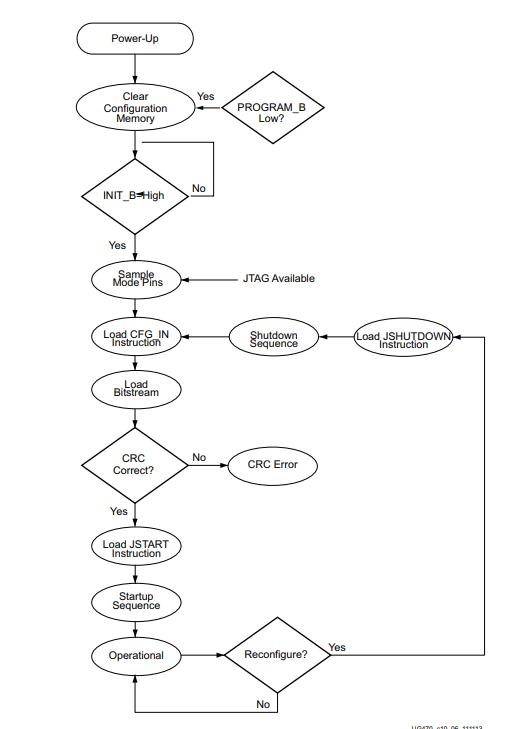

# Lab: Bus-Sniffing and JTAG 

## Goal:

In this assignment you are going to identify the JTAG header and the use a logic analyzer to listen and eventually interact with the TAP.

## Setup:

For this lab we will need three items.

1. Basys3 Dev Board (w/ MicroUSB cable for programming)
2. A computer with openocd installed.
3. Saleae Logic Analyzer + [Logic2 Software] (https://www.saleae.com/pages/downloads)

## Part 1 - Identify JTAG

On the back of the JTAG, there are two sets of 5 testpoints - one on each side of the board underneath the PMOD headers. One of these testpoint sets are JTAG.

Use the Saleae Logic Analyzer to sniff each of these testpoints while Vivado is connected to the device with Hardware Manager Running (how you program a bitstream in Vivado) to identify activity on these pads. 

Using the traces captured from the Saleae identify the relevant JTAG signals (TMS, TCK, TDI, TDO) we need in order to accurately detect what communication is sent to the device. 

If Vivado is too noisy, feel free to use the `part1.cfg` file to listen to openocd interact with the device. To use this script, run `openocd -f part1.cfg`.

## Part 2 - Interact with JTAG, Collect Traces

Once you have accurately identified the correct set of test points and signals, modify the openocd script to accomplish 4 goals. You will need to refer to [this user guide](https://docs.amd.com/v/u/en-US/ug470_7Series_Config) to find the correct JTAG instructions to complete this lab.

1. Manually Read the IDCODE of the Device.

2. Execute a JTAG SAMPLE Command.

3. Read out the Device FuseDNA.

4. Program top.bit to the device.

In this section you will only use the openocd commands `irscan` and `drscan` for steps 1-3.

`irscan` will instruct openocd to navigate the TAP and program in a JTAG instruction to the Instruction Register.

ex) `irscan xc7.tap 0x0`

`drscan` will instruct openocd to navigate the TAP and program data into the JTAG Data Register.

ex) `drscan xc7.tap 0x0`

In step 4, openocd provides a built in function for programming the FPGA. It is called `pld load <filename>`.

Call this instruction by first interacting with the device in the correct order to program the bitstream. Follow the flow chart from the documentation.

## Deliverables

Turn in the following on Canvas:
1. Your modified version of the `basys3.cfg` that carries out steps 1-4 in Part 2.
2. Screenshots of Saleae traces showing correct activity happening on the JTAG TAP for steps 1-4.

## Notes:

- For programming the device, it is highly recommended to increase the JTAG frequencry significantly in order to reduce programming time. 
- Take time to familiarize yourself with the Saleae and its protocol analyzer capabilities.
